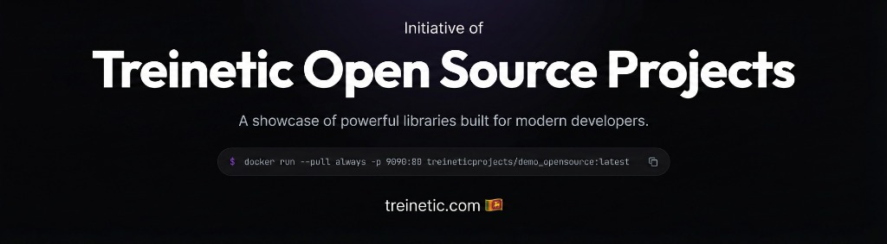

Try out before you actually use it 
`docker run --pull always -p 9090:80 treineticprojects/demo_opensource:latest`

# Treinetic Epub Reader 2.0.3

A modern, lightweight, and framework-agnostic EPUB reader for the web, built with TypeScript.
This project is an initiative of Treinetic (Pvt) Ltd, Sri Lanka.


[](LICENSE)


This library allows you to easily embed an EPUB reader into any web application. It handles parsing, rendering, pagination, and navigation, while leaving the UI (buttons, sidebars, menus) completely up to you.

---

## Features

| Feature | Description |
| :--- | :--- |
| **Framework Agnostic** | Works seamlessly with React, Vue, Angular, or Vanilla JS. |
| **Lightweight** | Zero heavy dependencies. Uses native Iframe isolation for security and style encapsulation. |
| **Fully Responsive** | **New:** Automatically adapts padding and font sizes using internal container logic (Internal Wrapper Pattern). |
| **Themable** | Inject custom CSS, change fonts, and toggle dark mode easily. |
| **TypeScript** | Fully typed for a great developer experience. |
| **Modern Build** | ESM and UMD support via Vite for modern bundlers. |
| **Continuous Scroll** | Support for both Paginated (Kindle-style) and Vertical Scrolling modes. |

## Requirements

-   NodeJS 16+ (for development)
-   Modern Browser (ES6 Support)

## Installation

### 1. NPM
Install the package via npm:

```bash
npm install @treinetic/treinetic-epub-reader
```

### 2. Manual
Alternatively, you can include the `dist/treinetic-epub-reader.umd.js` and `dist/style.css` manually in your project.

## Running the Demo

To see the reader in action with a sample UI:

```bash
git clone https://github.com/Treinetic/TreineticEpubReader.git
cd TreineticEpubReader
npm install
npm run demo
```
This will start a local server at `http://localhost:3001` with hot-reloading.

## Usage

### Basic Usage

First, import the necessary methods and CSS.

> [!NOTE]
> **v2.0.3 Update:** You can now use Named Exports for better compatibility with Vite and modern bundlers.

```typescript
import { create } from '@treinetic/treinetic-epub-reader';
import '@treinetic/treinetic-epub-reader/dist/style.css'; 

// Create the reader instance targeting your container
const reader = create("#epub-reader-frame");

// Load an EPUB file (url or base64)
// Note: Must be a valid .epub file, not a PDF.
// For correct path resolution in Vite, ensure files are in 'public/' or imported as assets.
import { open } from '@treinetic/treinetic-epub-reader';
open("path/to/book.epub");
```

### HTML Structure
Create a container for the reader. The library will inject an internal wrapper and iframe into this div.

```html
<div id="epub-reader-frame" style="width: 100%; height: 600px;"></div>
```
> [!TIP]
> You can resize this container at will. The reader monitors its own size and adjusts layouts (padding, columns) automatically.

### Controlling the Reader

```typescript
// Navigation
document.getElementById('next-btn').onclick = () => reader.nextPage();
document.getElementById('prev-btn').onclick = () => reader.prevPage();

// Settings
reader.setTheme('night'); // 'day', 'night', 'sepia'
reader.setFontSize(120);  // Percentage
```

### API Reference

| Method | Signature | Description |
| :--- | :--- | :--- |
| `open` | `(url: string) => void` | Loads and renders an EPUB file. |
| `nextPage` | `() => void` | Navigates to the next page or chapter. |
| `prevPage` | `() => void` | Navigates to the previous page or chapter. |
| `goToPage` | `(href: string) => void` | Navigates to a specific spine item (chapter). |
| `getTOC` | `() => TOCItem[]` | Returns the Table of Contents as a JSON tree. |
| `setTheme` | `(id: string) => void` | Switches themes (e.g. 'night', 'sepia', 'day'). |
| `registerTheme` | `(theme: ReaderTheme) => void` | Registers a new custom theme. |
| `setFontSize` | `(size: number) => void` | Sets font size (percentage, e.g. 120). |
| `setScrollOption`| `(mode: 'auto' \| 'scroll-continuous')` | Toggle between Paginated and Vertical Scroll. |
| `clearSettings` | `() => void` | Resets all user preferences (font, theme, location). |

### Keyboard Shortcuts
| Key | Action |
| :--- | :--- |
| `ArrowRight` | Next Page |
| `ArrowLeft` | Prev Page |

## 🎨 Advanced Customization

### Creating Custom Themes
You are not limited to the default themes. You can register your own:

```typescript
reader.registerTheme({
    id: 'matrix-theme',
    name: 'Matrix Mode',
    style: {
        'body': {
            'background-color': '#000000',
            'color': '#00FF00'
        },
        'p': {
            'font-family': 'monospace'
        }
    }
});

reader.setTheme('matrix-theme');
```

## 🗺️ Project Roadmap
We have an ambitious vision to make this the de facto standard for open-source EPUB rendering.
Please see our detailed [ROADMAP](roadmap.md) for upcoming features like Full-Text Search, Offline support, and Mobile gestures.

## Project Structure

This project has been modernized (v2.0.0) to separate the **Core Library** from the **Demo Application**.

*   `src/lib/`: **The Library**. Contains the core logic (`TreineticEpubReader.ts`, `ReaderView.ts`).
*   `src/css/`: **Library CSS**. `main.css` (layout) and `responsive.css` (adaptive padding).
*   `demo/`: **The Demo App**. Contains the UI (`index.html`, `demo.css`, `demo.js`).
*   `dist/`: **Build Output**. The compiled files published to NPM.

## Contributing
Please see [CONTRIBUTING](CONTRIBUTING.md) for details.

## Credits
-   [Imal Hasaranga Perera](https://github.com/imalhasaranga)
-   [Nuril Ahemad](https://github.com/nurilahemad)
-   [All Contributors](../../contributors)

## License
The MIT License (MIT). Please see [License File](LICENSE) for more information.
(Portions based on the original ReadiumJS viewer, BSD-3-Clause).
